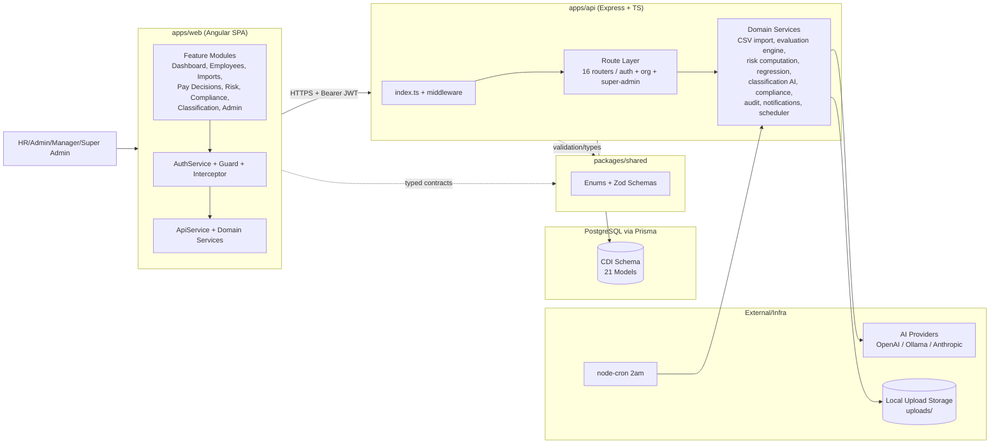

# CDI V2 Architecture Overview

## Scope

This overview documents the current architecture of `CDI_V2` as implemented in the codebase.

## Monorepo Structure

- `apps/web`: Angular 21 SPA (standalone components + Angular Material + RxJS)
- `apps/api`: Express + TypeScript API (JWT auth, RBAC, org scoping)
- `packages/shared`: Shared enums and Zod schemas used by both web and API
- `prisma`: Prisma schema, migrations, and seed/reset scripts

## Runtime Architecture

### Frontend (Angular SPA)

- Bootstraps with standalone config and HTTP interceptor for bearer auth
- Uses route guards for:
  - `SUPER_ADMIN` routes (`/admin/**`)
  - Org-scoped user routes (everything else)
- Calls API via `ApiService` wrappers and feature services

### Backend (Express API)

- API entrypoint mounts:
  - Public auth routes
  - Super admin routes
  - Org-scoped routes behind `authenticate + requireOrgScope`
- Middleware stack:
  - CORS
  - JSON parsing
  - request logging (`morgan`)
  - Zod/global error handler
- Scheduler:
  - Nightly risk recomputation (`2am`) for all organizations

### Shared Contracts

- `@cdi/shared` exports:
  - Domain enums (roles, decision statuses, check types, etc.)
  - Request/response Zod schemas used in route validation and frontend typing

### Data Layer

- PostgreSQL via Prisma
- 21 models grouped into domains:
  - Tenant/auth: `Organization`, `User`
  - Employee lifecycle: `Employee`, `EmployeeSnapshot`, `ImportJob`
  - Decision governance: `PayDecision`, `RationaleDefinition`, `PayDecisionRationale`, `PolicyRule`, `SalaryRange`
  - Analytics/compliance: `RiskRun`, `RiskGroupResult`, `AiRiskReport`, `RegressionRun`, `DisclosureTemplate`
  - Classification: `ClassificationDimension`, `RoleClassification`, `RoleClassificationTag`, `AiProviderConfig`
  - Audit/notifications: `AuditLog`, `Notification`

## Core Business Flows

### 1. Employee Import Flow

1. CSV uploaded to `/imports/employees/csv` (multer writes to local `uploads/`)
2. Headers/sample rows parsed
3. Column mapping suggested using OpenAI (fallback deterministic)
4. User confirms mapping
5. Background import upserts employees + writes immutable snapshots
6. Import completion triggers async risk recomputation

### 2. Pay Decision Governance Flow

1. Draft decision created for an employee
2. Decision-time snapshot context computed (tenure, compa ratio, history)
3. Rationale definitions resolved and frozen into `PayDecisionRationale`
4. On submit, policy checks run (5 check types)
5. Warnings may require acknowledgement; blocks prevent submission
6. Approve/finalise transitions decision to immutable state and triggers risk recomputation

### 3. Risk & Reporting Flow

1. Risk run triggered by import, finalise/approve action, manual run, or nightly cron
2. Employees grouped by comparator keys and gender gap computed
3. Group results stored in `RiskGroupResult`
4. Optional AI narrative enrichment generates `AiRiskReport`
5. Regression analysis endpoint runs controlled OLS and stores `RegressionRun`

### 4. Classification & Compliance Flow

1. Classification dimensions define equal-value rubric
2. Roles can be AI-classified (OpenAI/Ollama/Anthropic via provider abstraction)
3. HR confirms classifications
4. Compliance endpoints compute readiness metrics and generate disclosure text/audit pack ZIP

## High-Level Architecture Diagram

## Notable Implementation Characteristics

- Multi-tenant isolation is enforced primarily by org-scoped queries and route guards.
- Decision and import snapshots provide auditability and historical traceability.
- Audit logging is fire-and-forget to avoid blocking user actions.
- AI usage is optional and has deterministic/non-AI fallback paths for key workflows.
- Report endpoints under `/reports` are scaffolded but currently return `501`.
